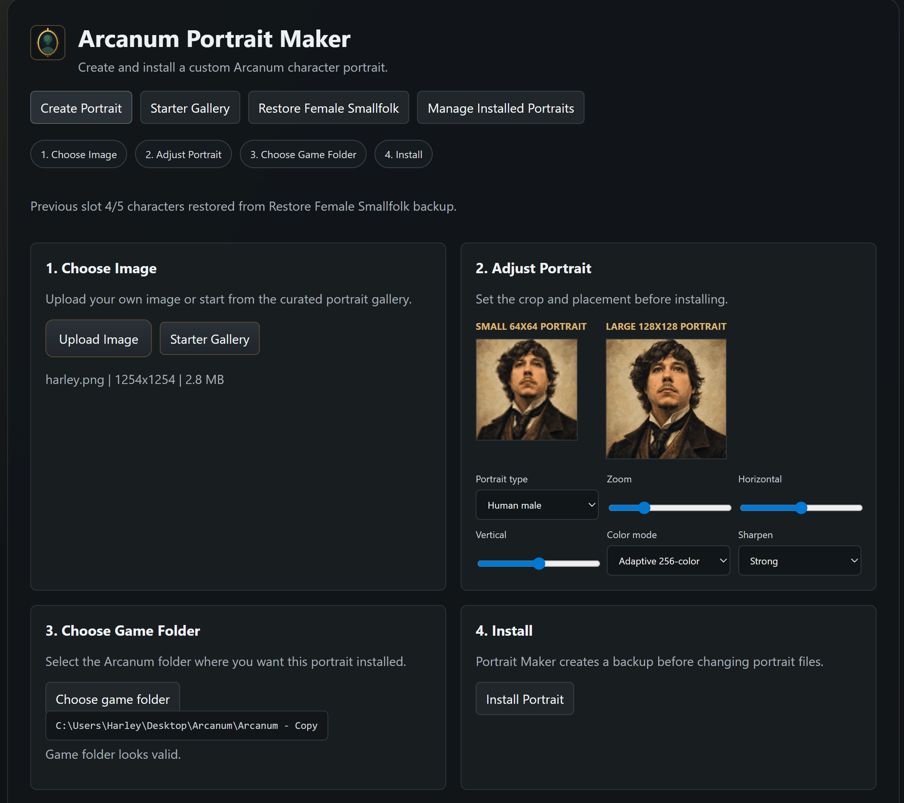
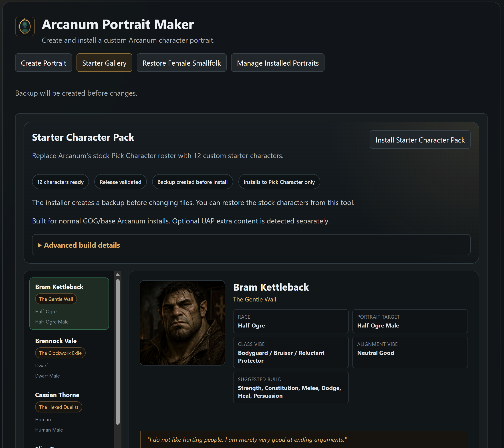
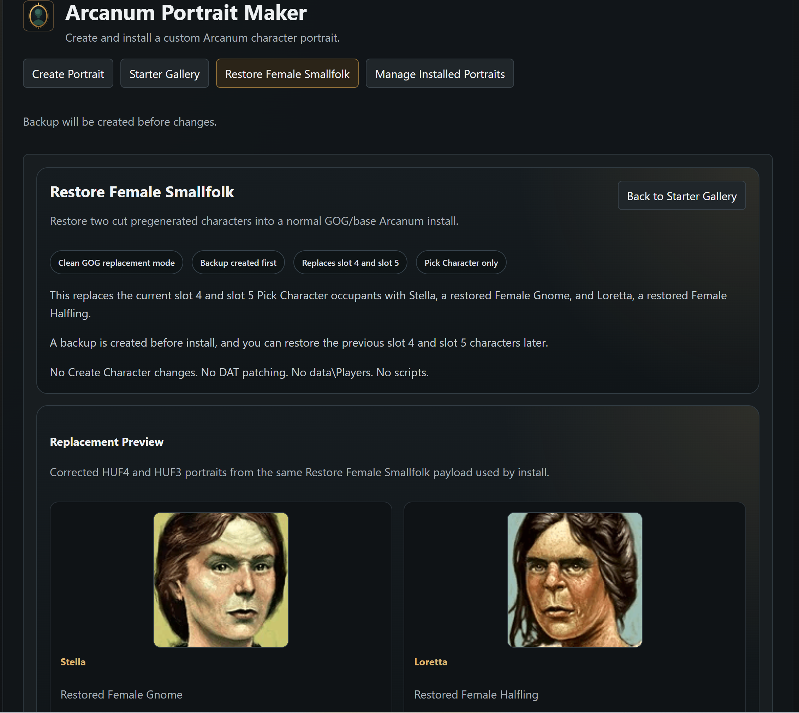
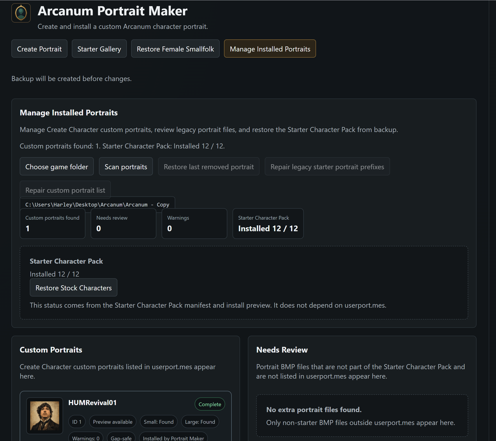

# Arcanum Portrait Maker

Arcanum Portrait Maker is a Windows desktop utility for installing custom portraits, a curated Starter Character Pack, and the Restore Female Smallfolk replacement set for Arcanum: Of Steamworks and Magick Obscura.

Validated public release: `v1.1.0` on GitHub Release tag `v1.1.0`.

The Starter Character Pack replaces the 12 stock pregenerated Pick Character characters with new starter characters. Restore Female Smallfolk replaces Pick Character slots 4 and 5 with Stella and Loretta. Both systems remain separate from the Create Character portrait tool. Installing the Starter Character Pack does not add the 12 starter portraits to `userport.mes`, and Restore Female Smallfolk does not add Stella or Loretta to Create Character.

I have not seen a polished full stock pregen replacement pack for Arcanum before, so this project attempts to provide one. All characters come with a bio/story and some even a unique starting item. Future plans are custom quest lines for the characters. Perhaps you will help figure out the curse of Sir Rogers? Any artist that want to help contribute to the project I am looking for someone to replace the current portraits with hand drawn or made if possible. 

## Screenshots

The full 12-character portrait set is included in [screenshots/](screenshots/).

## Download

Download the app from the GitHub Release asset, not the green `Code` button. The repository ZIP only contains public project files and documentation.

Release page:
`https://github.com/HarleyFolgado/arcanum-portrait-maker/releases/tag/v1.1.0`

Release asset:
`ArcanumPortraitMaker-v1.1.0-win32-x64.zip`

Validated SHA256:
`4A36BB2A5E97935321A7FAAB0DF648BEEB91CB0A1F2EA7A4CE673DB1DC13BFB1`

1. Open the GitHub Release page for tag `v1.1.0`.
2. Download `ArcanumPortraitMaker-v1.1.0-win32-x64.zip`.
3. Extract the ZIP to a normal folder.
4. Run `ArcanumPortraitMaker.exe`.
5. Choose your Arcanum install folder inside the app.

Arcanum must be installed separately. This repository and its releases do not include the game itself.

## What It Does

- Installs a 12-character replacement roster for Single Player -> New Game -> Pick Character.
- Installs Restore Female Smallfolk for Pick Character slot 4 and slot 5.
- Uses Stella for Female Gnome and Loretta for Female Halfling.
- Keeps Create Character custom portrait installation separate.
- Creates a timestamped restore point before replacing Starter Character Pack files.
- Creates a timestamped restore point before replacing Restore Female Smallfolk files.
- Restores stock characters from the app-created restore point.
- Restores the previous slot 4/5 occupants from the app-created Restore Female Smallfolk backup.
- Detects old Create Character starter portrait entries without removing them automatically.

## Validated v1.1.0 Status

- 12 validated starter characters ship in the Starter Character Pack.
- Install and uninstall support are included through the app preview, install, backup, and restore flow.
- Restore Female Smallfolk support is included through preview, packaged portrait preview, install, backup, and restore.
- Restore Female Smallfolk supports clean GOG/base installs and compatible Starter Character Pack slot replacement installs.
- No Starter Character Pack leakage into Create Character was confirmed in validation.
- Restore Female Smallfolk does not add Create Character support for Stella or Loretta.
- Starting gear was confirmed working for the validated roster.
- No DAT patching is used for Restore Female Smallfolk.
- No `data/Players` payload is used for Restore Female Smallfolk.
- No scripts are installed for Restore Female Smallfolk.
- Optional UAP extra content is not part of `v1.1.0` support.

## Requirements

- Windows.
- A legally installed copy of Arcanum.
- A writable copy of the Arcanum install folder. A throwaway copy is recommended for first-time testing.

This project does not include Arcanum, an Arcanum executable, DAT archives, official game assets, WorldEd, Factory tools, or patch archives.

## Install Starter Character Pack

1. Download `ArcanumPortraitMaker-v1.1.0-win32-x64.zip` from the GitHub Release tag `v1.1.0`.
2. Extract the app folder.
3. Run `ArcanumPortraitMaker.exe`.
4. Open `Starter Character Pack`.
5. Choose your Arcanum install folder.
6. Preview the install.
7. Click `Install Starter Character Pack`.
8. Open Arcanum manually and go to Single Player -> New Game -> Pick Character.

## Restore Stock Characters

1. Open `Manage Installed Portraits`.
2. Choose the same Arcanum install folder.
3. Scan.
4. Use `Restore Stock Characters`.

Restore uses backups created by this app. It does not reconstruct stock files from DAT archives.

## Install Restore Female Smallfolk

1. Run `ArcanumPortraitMaker.exe`.
2. Open `Restore Female Smallfolk`.
3. Choose your Arcanum install folder.
4. Review the replacement preview for slot 4 and slot 5.
5. Install Stella and Loretta.
6. Open Arcanum manually and use `Single Player -> New Game -> Pick Character`.

Restore Female Smallfolk replaces two Pick Character slots only. Stella is the restored Female Gnome and Loretta is the restored Female Halfling.

## Restore Previous Slot 4/5 Characters

1. Open `Restore Female Smallfolk`.
2. Choose the same Arcanum install folder.
3. Use `Restore previous slot 4/5 characters`.

Restore uses the backup created before Stella and Loretta were installed. On stock/base installs this restores the stock slot occupants. On Starter Character Pack installs this restores the prior starter-pack occupants for slot 4 and slot 5.

## Create Character Portraits

The Create Custom Portrait workflow still writes custom portraits through `data/portrait/userport.mes`. This is separate from the Starter Character Pack.

Manage Installed Portraits treats these as different systems:

- Create Character custom portraits use `userport.mes`.
- Starter Character Pack status uses the starter-pack manifest and installed replacement files.

## Compatibility Notes

- Tested against a clean GOG/base Arcanum install workflow.
- Other mods that replace the same pregenerated character files or the same `.mes` records may conflict.
- Restore Female Smallfolk does not require UAP.
- Restore Female Smallfolk uses loose-file replacement and backup restore, not DAT patching.
- Restore Female Smallfolk does not add `data/Players` or script payloads.
- Optional UAP Race Mod / extra content support is not part of `v1.1.0`.
- Always test on a copied install before using a long-term play install.
