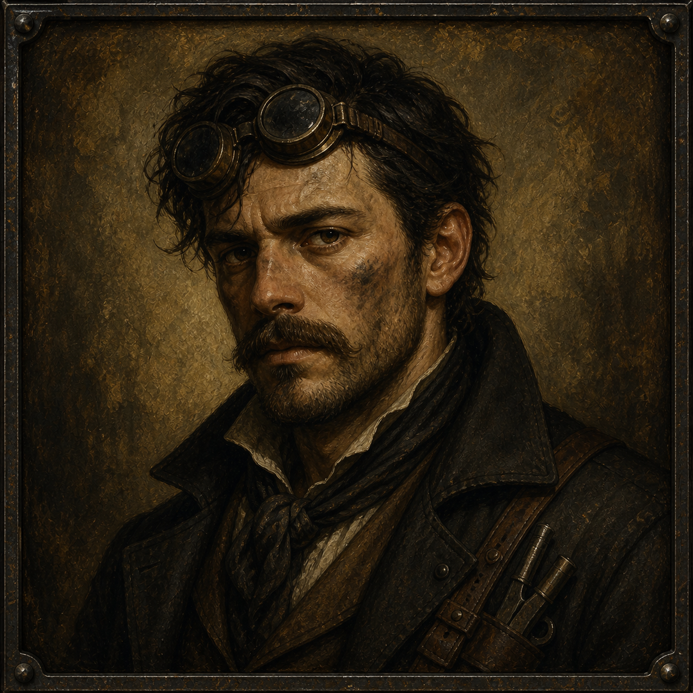
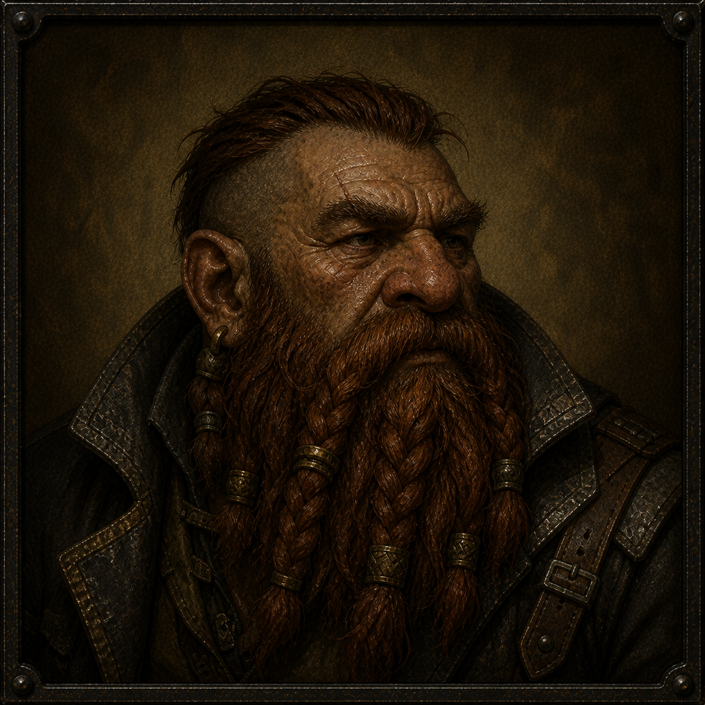
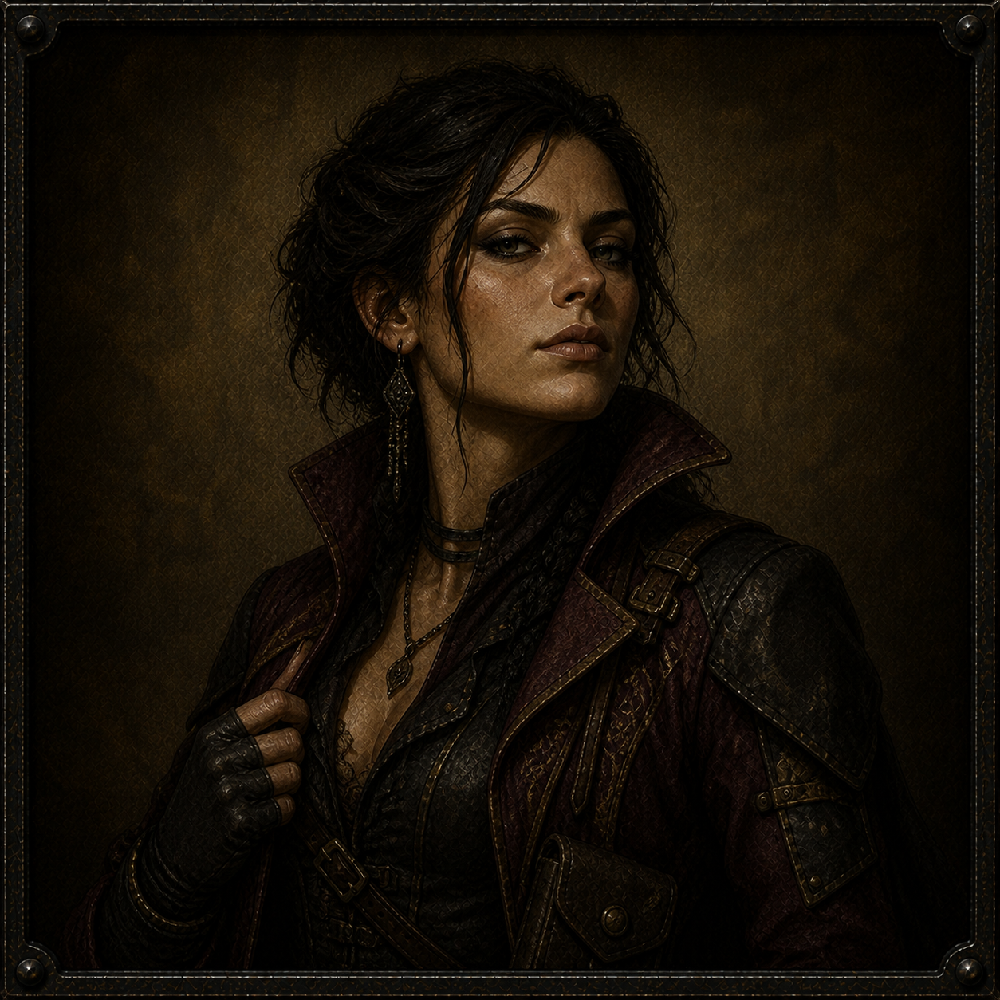
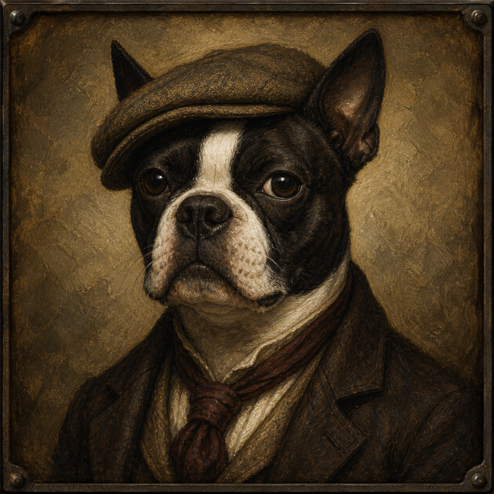

# Arcanum Portrait Maker

Arcanum Portrait Maker is a Windows desktop utility for installing custom portraits and a curated Starter Character Pack for Arcanum: Of Steamworks and Magick Obscura.

The Starter Character Pack replaces the 12 stock pregenerated Pick Character characters with new starter characters. It is separate from the Create Character portrait tool. Installing the Starter Character Pack does not add the 12 starter portraits to `userport.mes`.

I have not seen a polished full stock pregen replacement pack for Arcanum before, so this project attempts to provide one.

## Screenshots

The full 12-character portrait set is included in [screenshots/](screenshots/).

## Download

Download the app from the GitHub Releases page, not the green `Code` button. The repository ZIP only contains public project files and documentation.

1. Open the Releases page.
2. Download the Windows ZIP for Arcanum Portrait Maker.
3. Extract the ZIP to a normal folder.
4. Run `ArcanumPortraitMaker.exe`.
5. Choose your Arcanum install folder inside the app.

Arcanum must be installed separately. This repository and its releases do not include the game itself.

## What It Does

- Installs a 12-character replacement roster for Single Player -> New Game -> Pick Character.
- Keeps Create Character custom portrait installation separate.
- Creates a timestamped restore point before replacing Starter Character Pack files.
- Restores stock characters from the app-created restore point.
- Detects old Create Character starter portrait entries without removing them automatically.

## Requirements

- Windows.
- A legally installed copy of Arcanum.
- A writable copy of the Arcanum install folder. A throwaway copy is recommended for first-time testing.

This project does not include Arcanum, an Arcanum executable, DAT archives, official game assets, WorldEd, Factory tools, or patch archives.

## Install Starter Character Pack

1. Download the Windows ZIP from GitHub Releases.
2. Extract the app folder.
3. Run `ArcanumPortraitMaker.exe`.
4. Open `Starter Character Pack`.
5. Choose your Arcanum install folder.
6. Preview the install.
7. Click `Install Starter Character Pack`.
8. Open Arcanum manually and go to Single Player -> New Game -> Pick Character.

## Restore Stock Characters

1. Open `Manage Installed Portraits`.
2. Choose the same Arcanum install folder.
3. Scan.
4. Use `Restore Stock Characters`.

Restore uses backups created by this app. It does not reconstruct stock files from DAT archives.

## Create Character Portraits

The Create Custom Portrait workflow still writes custom portraits through `data/portrait/userport.mes`. This is separate from the Starter Character Pack.

Manage Installed Portraits treats these as different systems:

- Create Character custom portraits use `userport.mes`.
- Starter Character Pack status uses the starter-pack manifest and installed replacement files.

## Compatibility Notes

- Tested against a loose-file Arcanum install workflow.
- Other mods that replace the same pregenerated character files or the same `.mes` records may conflict.
- Always test on a copied install before using a long-term play install.
